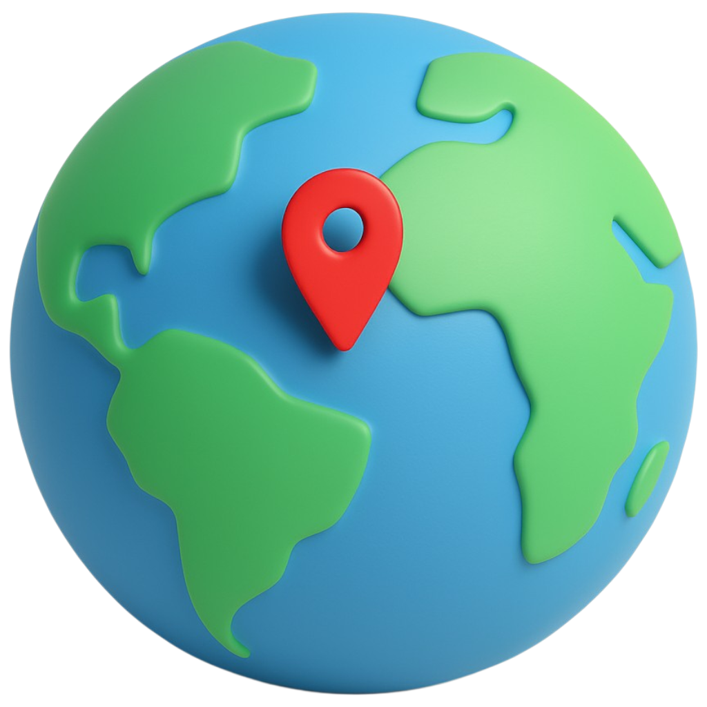

# Find On Map

<a id="readme-top"></a>

<!-- LANGUAGE SHIELDS -->
<div align="center">

[![English][english-shield]][english-url]
[![Turkish][turkish-shield]][turkish-url]

</div>

<!-- PROJECT SHIELDS -->
<div align="center">

[![Contributors][contributors-shield]][contributors-url]
[![Forks][forks-shield]][forks-url]
[![Stargazers][stars-shield]][stars-url]
[![Issues][issues-shield]][issues-url]
[![License][license-shield]][license-url]
[![LinkedIn][linkedin-shield]][linkedin-url]

</div>

<!-- PROJECT LOGO/TITLE -->
<br />

<div align="center">
  <a href="https://github.com/aysedemirel/find-on-map">
    
  </a>
<h3 align="center">Find On Map</h3>
  <p align="center">
    Find on Map is an open-source, map-based location guessing game.
Players are shown a random street-level image and must guess the correct location on the map.
    <br/>
    The closer the guess, the higher the score. Simple, fun, and educational!
    <br />
    <a href="https://github.com/aysedemirel/find-on-map"><strong>Explore the docs »</strong></a>
    <br />
    <br />
    <a href="https://findonmap.netlify.app/">Play Game</a>
    ·
    <a href="https://github.com/aysedemirel/find-on-map/issues/new?labels=bug&template=bug-report---.md">Report Bug</a>
    ·
    <a href="https://github.com/aysedemirel/find-on-map/issues/new?labels=enhancement&template=feature-request---.md">Request Feature</a>
  </p>
</div>

<!-- TABLE OF CONTENTS -->
<details>
  <summary>Table of Contents</summary>
  <ol>
    <li>
      <a href="#about-the-project">About The Project</a>
      <ul>
        <li><a href="#built-with">Built With</a></li>
      </ul>
    </li>
    <li>
      <a href="#getting-started">Getting Started</a>
      <ul>
        <li><a href="#prerequisites">Prerequisites</a></li>
        <li><a href="#installation">Installation</a></li>
      </ul>
    </li>
    <li><a href="#usage">Usage</a></li>
    <li><a href="#roadmap">Roadmap</a></li>
    <li><a href="#contributing">Contributing</a></li>
    <li><a href="#license">License</a></li>
    <li><a href="#contact">Contact</a></li>
    <li><a href="#acknowledgments">Acknowledgments</a></li>
  </ol>
</details>

<!-- ABOUT THE PROJECT -->

## About The Project

Find on Map is a fun and educational map-based guessing game. The main idea is simple:
you are shown a random street-level image from anywhere in the world, and your task is to find its location on the map.

The game combines exploration, geography, and observation skills into a single experience:

- 🌍 Explore the world from your screen through real street imagery
- 🧠 Train your brain by recognizing landmarks, signs, and landscapes.
- 🎮 Challenge yourself to guess as close as possible and score higher points.

The project was built as an experiment in combining open data (via Mapillary API
) with interactive mapping tools.
It’s designed to be lightweight, open-source, and easy to extend—perfect for developers, educators, or anyone who enjoys map-based games.

<p align="right">(<a href="#readme-top">back to top</a>)</p>

### Built With

- [![React][React.js]][React-url]
- [![TypeScript][TypeScript.js]][TypeScript-url]
- [![Vite][Vite.js]][Vite-url]
- [![React Leaflet][React-Leaflet.js]][React-Leaflet-url]
- [![MapillaryJS][Mapillary.js]][Mapillary-url]
- [![Zustand][Zustand.js]][Zustand-url]
- [![Sass][Sass.js]][Sass-url]
- [![Netlify][Netlify.js]][Netlify-url]

<p align="right">(<a href="#readme-top">back to top</a>)</p>

## Getting Started

Follow these steps to run the project locally:

### Prerequisites

- Node.js >= 18
- npm >= 9
- API key from Mapillary

### Installation

1. Clone the repo

```
git clone https://github.com/your-username/mapillary-geoguessr-clone.git
cd mapillary-geoguessr-clone
```

2. Install dependencies

```
npm install
```

3. Get a free API Key at [https://www.mapillary.com/developer](https://www.mapillary.com/developer)
4. Create a .env file in the project root:

```
VITE_MAPILLARY_TOKEN=/api
```

### Executing Program

Run locally:

```
npm run dev
```

<p align="right">(<a href="#readme-top">back to top</a>)</p>

## Usage

- Open the app in your browser
- Explore the panorama through MapillaryJS
- Try to guess where in the world you are 🌍
- Mark your prediction on the map within the 2-minute time limit


<p align="right">(<a href="#readme-top">back to top</a>)</p>

## Roadmap

- [x] Random location generator
- [x] Street-view viewer with MapillaryJS
- [ ] Guessing mechanic with interactive map
- [ ] Scoring system
- [ ] Multiplayer support

See the [open issues](https://github.com/aysedemirel/find-on-map/issues) for a full list of proposed features (and known issues).

<p align="right">(<a href="#readme-top">back to top</a>)</p>

## Contributing

Contributions are what make the open source community such an amazing place to learn, inspire, and create. Any contributions you make are **greatly appreciated**.

If you have a suggestion that would make this better, please fork the repo and create a pull request. You can also simply open an issue with the tag "enhancement".
Don't forget to give the project a star! Thanks again!

1. Fork the Project
2. Create your Feature Branch (`git checkout -b feature/AmazingFeature`)
3. Commit your Changes (`git commit -m 'Add some AmazingFeature'`)
4. Push to the Branch (`git push origin feature/AmazingFeature`)
5. Open a Pull Request

### Top contributors:

<a href="https://github.com/aysedemirel/find-on-map/graphs/contributors">
  
</a>

<p align="right">(<a href="#readme-top">back to top</a>)</p>

## Contact

Ayşe Demirel Deniz - [Linkedln - aysedemirel](https://www.linkedin.com/in/ayse-demirel/) - aysedemireldeniz@gmail.com

<p align="right">(<a href="#readme-top">back to top</a>)</p>

<!-- MARKDOWN LINKS & IMAGES -->
<!-- https://www.markdownguide.org/basic-syntax/#reference-style-links -->

<!--URL-->

[english-url]: https://github.com/aysedemirel/find-on-map
[turkish-url]: https://github.com/aysedemirel/find-on-map
[contributors-url]: https://github.com/aysedemirel/find-on-map/graphs/contributors
[forks-url]: https://github.com/aysedemirel/find-on-map/network/members
[stars-url]: https://github.com/aysedemirel/find-on-map/stargazers
[issues-url]: https://github.com/aysedemirel/find-on-map/issues
[license-url]: https://github.com/aysedemirel/find-on-map/blob/master/LICENSE.txt
[linkedin-url]: https://www.linkedin.com/in/ayse-demirel/

<!--SHIELD-->

[english-shield]: https://img.shields.io/badge/English-En-blue?style=for-the-badge
[turkish-shield]: https://img.shields.io/badge/Turkish-Tr-red?style=for-the-badge
[contributors-shield]: https://img.shields.io/github/contributors/aysedemirel/find-on-map.svg?style=for-the-badge
[forks-shield]: https://img.shields.io/github/forks/aysedemirel/find-on-map.svg?style=for-the-badge
[stars-shield]: https://img.shields.io/github/stars/aysedemirel/find-on-map.svg?style=for-the-badge
[issues-shield]: https://img.shields.io/github/issues/aysedemirel/find-on-map.svg?style=for-the-badge
[license-shield]: https://img.shields.io/github/license/aysedemirel/find-on-map.svg?style=for-the-badge
[linkedin-shield]: https://img.shields.io/badge/-LinkedIn-black.svg?style=for-the-badge&logo=linkedin&colorB=555
[product-screenshot]: images/screenshot.png
[React.js]: https://img.shields.io/badge/React-20232A?style=for-the-badge&logo=react&logoColor=61DAFB
[Vue.js]: https://img.shields.io/badge/Vue.js-35495E?style=for-the-badge&logo=vuedotjs&logoColor=4FC08D
[Angular.io]: https://img.shields.io/badge/Angular-DD0031?style=for-the-badge&logo=angular&logoColor=white
[Svelte.dev]: https://img.shields.io/badge/Svelte-4A4A55?style=for-the-badge&logo=svelte&logoColor=FF3E00
[Laravel.com]: https://img.shields.io/badge/Laravel-FF2D20?style=for-the-badge&logo=laravel&logoColor=white
[Bootstrap.com]: https://img.shields.io/badge/Bootstrap-563D7C?style=for-the-badge&logo=bootstrap&logoColor=white
[JQuery.com]: https://img.shields.io/badge/jQuery-0769AD?style=for-the-badge&logo=jquery&logoColor=white
[React.js]: https://img.shields.io/badge/React-20232A?style=for-the-badge&logo=react&logoColor=61DAFB
[React-url]: https://react.dev/
[TypeScript.js]: https://img.shields.io/badge/TypeScript-007ACC?style=for-the-badge&logo=typescript&logoColor=white
[TypeScript-url]: https://www.typescriptlang.org/
[Vite.js]: https://img.shields.io/badge/Vite-646CFF?style=for-the-badge&logo=vite&logoColor=FFD62E
[Vite-url]: https://vitejs.dev/
[React-Leaflet.js]: https://img.shields.io/badge/React%20Leaflet-199900?style=for-the-badge&logo=leaflet&logoColor=white
[React-Leaflet-url]: https://react-leaflet.js.org/
[Mapillary.js]: https://img.shields.io/badge/MapillaryJS-06A77D?style=for-the-badge&logo=mapbox&logoColor=white
[Mapillary-url]: https://mapillary.github.io/mapillary-js/
[Zustand.js]: https://img.shields.io/badge/Zustand-000000?style=for-the-badge&logo=react&logoColor=white
[Zustand-url]: https://github.com/pmndrs/zustand
[Netlify.js]: https://img.shields.io/badge/Netlify-00C7B7?style=for-the-badge&logo=netlify&logoColor=white
[Netlify-url]: https://www.netlify.com/
[Sass.js]: https://img.shields.io/badge/Sass-CC6699?style=for-the-badge&logo=sass&logoColor=white
[Sass-url]: https://sass-lang.com/
